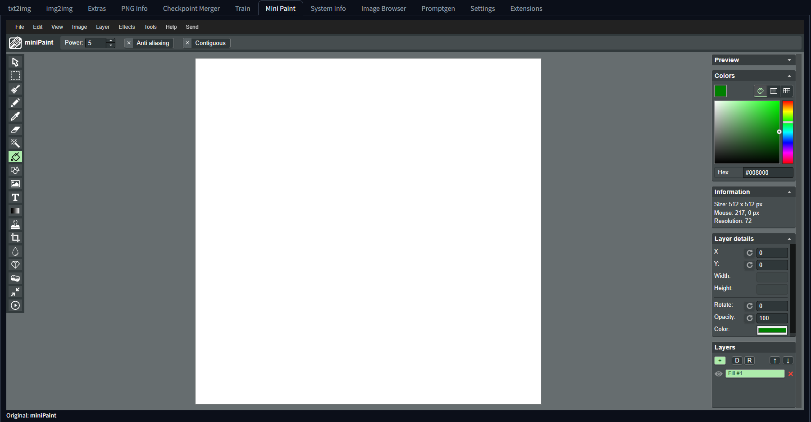
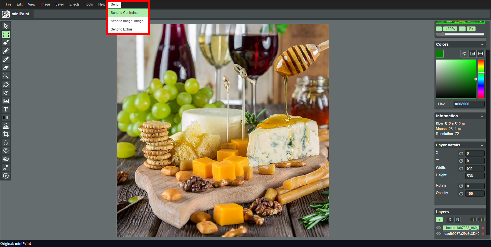
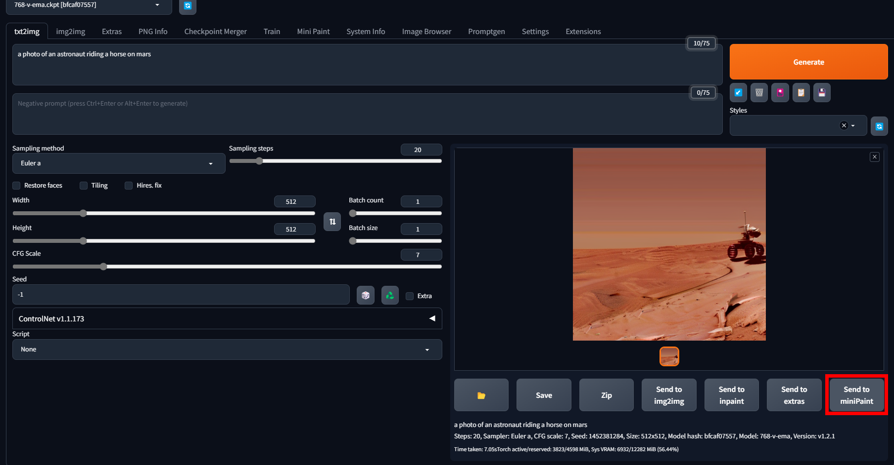

# AUTOMATIC1111 WebUI [miniPaint](https://github.com/viliusle/miniPaint) extension

## Installation

This extension is listed in the official extension index an can be installed easily:  
Extensions -> Available -> Click `Load from` -> Search for `miniPaint` and press `Install`

## About this extension

This extension provides a integrated version of the [miniPaint](https://github.com/viliusle/miniPaint) image editor.  

It is a simple image editing tool but still satisfies most needs when trying to edit images.  
It provides the ability to send images to Img2Img, Controlnet and Extras.  
Images can also be sent from txt2img, img2img and extras directly to the extension via the 'Send to miniPaint' Button.  

## Issues, Code ownership and contribution

This extension is mostly code slammed together from other extensions all being free to use. If you want to grab parts of it, go ahead.  
If you find a bug, just report it over the issues section on github. Because i am still in school, feel free to fix the issues yourself and create a pull request.

## Modifying for yourself

If you want to customize certain things which are inside the miniPaint iframe, go into the miniPaint directory and run `npm run dev`  or `npm run build` and then reload your ui.
